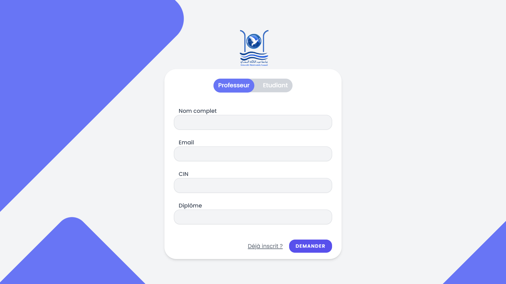
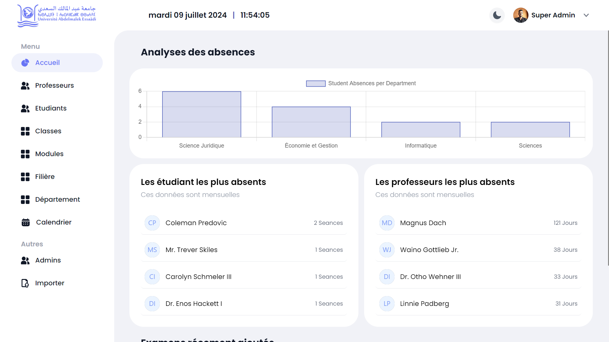
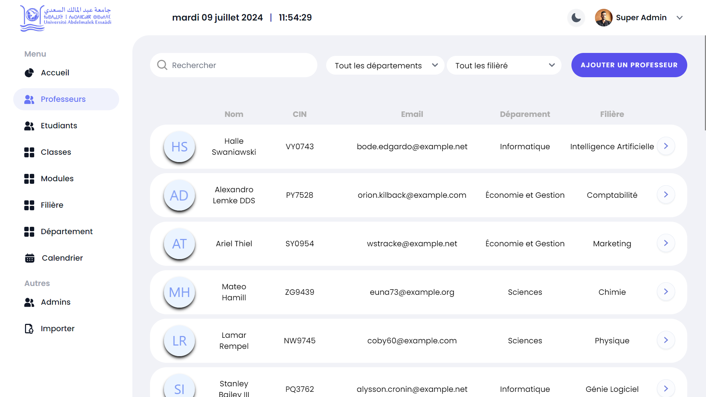
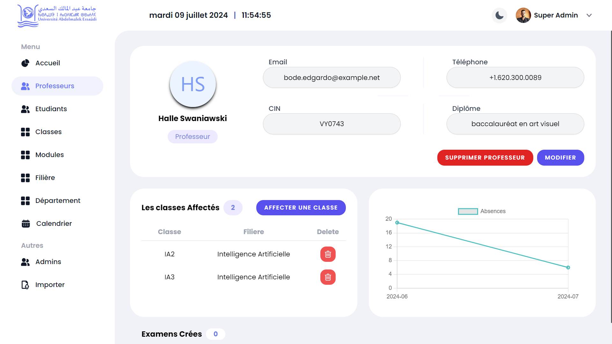
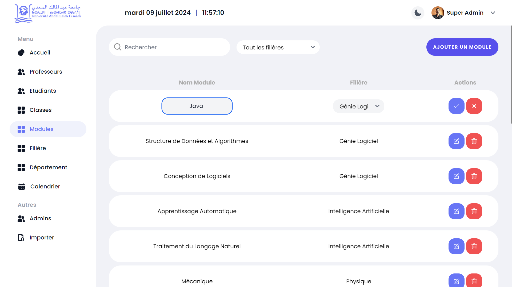
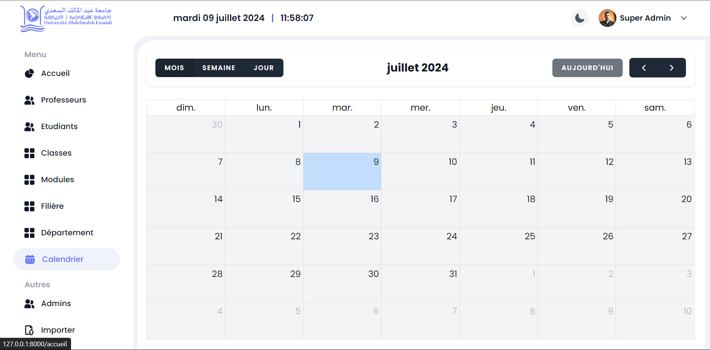
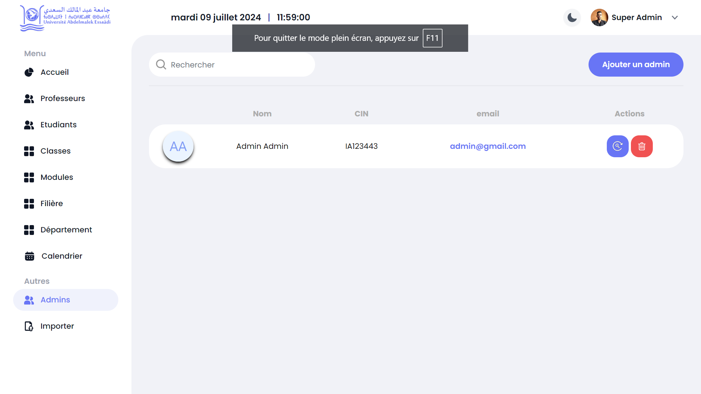
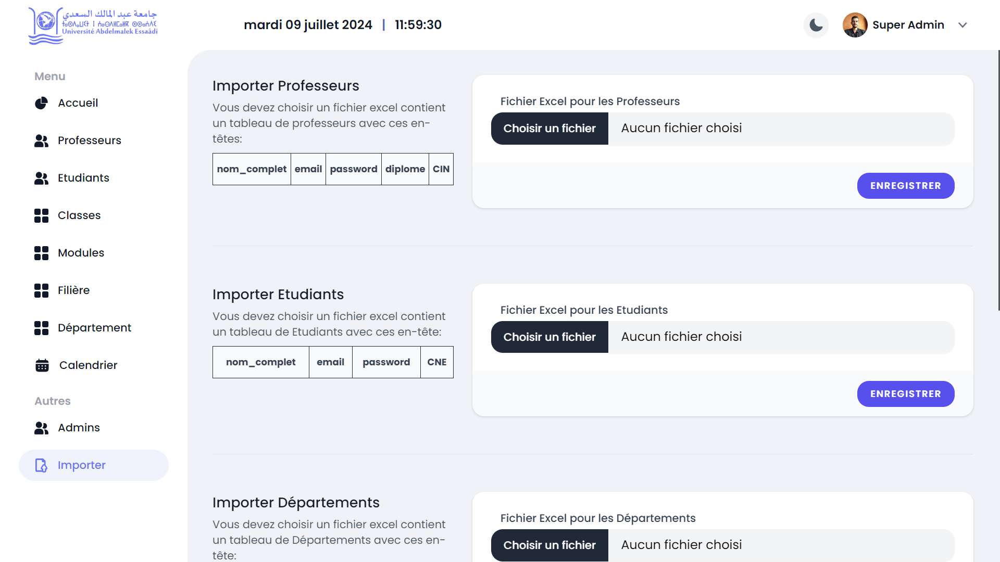
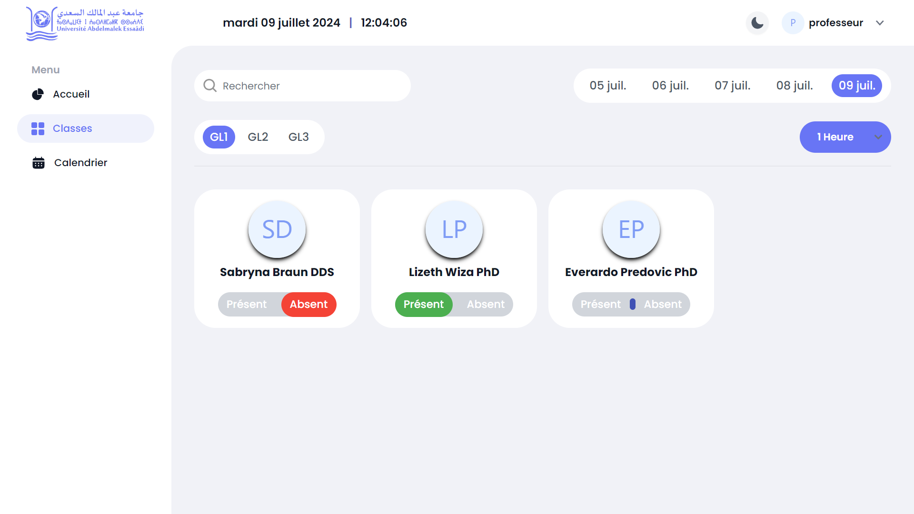
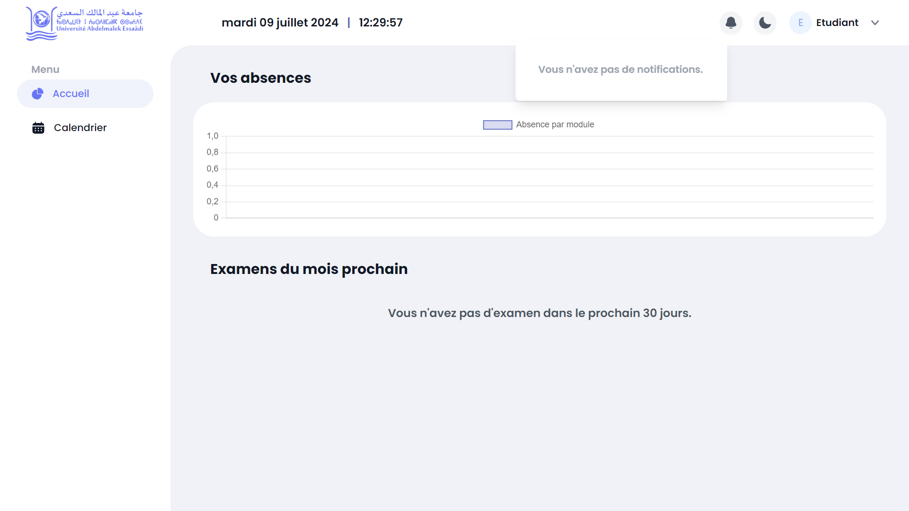

# ClassMate - Gestion d'Absences et d'Examens

ClassMate est une application web innovante conçue pour faciliter la gestion des absences et des examens dans les établissements académiques. Développée dans le cadre de notre projet de fin d'études, cette plateforme offre une solution complète et intuitive pour les enseignants, les étudiants, et les administrateurs.

## Table des matières
- [Fonctionnalités Principales](#fonctionnalités-principales)
- [Installation](#installation)
- [Utilisation](#utilisation)
- [Captures d'Écran](#captures-décran)
- [Technologies Utilisées](#technologies-utilisées)
- [Contribution](#contribution)
- [Authors and Acknowledgment](#Authors-and-Acknowledgment)
- [Licence](#licence)

## Fonctionnalités Principales
- **Connexion Sécurisée** : Authentification avec Laravel JetStream.
- **Gestion des Comptes** : Création, gestion des utilisateurs et réinitialisation des mots de passe.
- **Gestion Académique** : Création et gestion des départements, filières, modules, et classes.
- **Suivi des Absences** : Visualisation et gestion des absences des étudiants et des professeurs.
- **Planification des Examens** : Définition des dates des examens avec consultation via un calendrier intégré.
- **Notifications en Temps Réel** : Utilisation de Pusher pour des notifications instantanées.
- **Dark/Light Mode:** Choose between a dark or light theme.

## Installation
1. Clonez le dépôt :
   ```bash
   git clone https://github.com/Ilyass-Bezaiz/ClassMate.git
   ```
2. Accédez au répertoire du projet :
   ```bash
   cd ClassMate
   ```
3. Installez les dépendances :
   ```bash
   composer install
   npm install
   ```
4. Configurez l'environnement en dupliquant le fichier `.env.example` :
   ```bash
   cp .env.example .env
   php artisan key:generate
   ```
5. Lancer les migrations et seeders :
   ```bash
   php artisan migrate --seed
   ```
6. Compilez les assets :
   ```bash
   npm run dev
   ```
7. Démarrez le serveur Laravel :
   ```bash
   php artisan serve
   ```

## Utilisation
- **Gestion des Absences** : Naviguez vers la section Absences pour voir, ajouter, ou modifier les absences des étudiants.
- **Planification des Examens** : Utilisez la section Calendrier pour définir les dates et consulter les Examens et absences.
- **Notifications** : Recevez des notifications en temps réel lors de mises à jour importantes.

## Captures d'Écran

### Login Page


### Demande Compte


### Admin Dashboard


### Professeurs Page


### Professeur Profile


### Modules Page


### Calendrier Page


### Admins Page


### Importer depuis Excel Page


### Marquer absence Page


### Student dashboard


## Technologies Utilisées
- **Laravel** : Framework backend pour un développement rapide.
- **LiveWire** : Pour des interfaces dynamiques sans rechargement de page.
- **Alpine.js** : Pour l'interactivité côté client.
- **Tailwind CSS** : Pour un design moderne et réactif.
- **Chart.js** : Visualisation des données.
- **FullCalendar** : Calendrier intégré pour les absences et les examens.
- **Pusher** : Notifications en temps réel.
- **JetStream** : Gestion de l'authentification.
- **MotionOne** : Animations fluides.

## Contribution
Les contributions sont les bienvenues ! Si vous souhaitez améliorer ce projet, veuillez forker le dépôt et soumettre une pull request.

## Authors and Acknowledgment

- [Ilyass Bezaiz](https://github.com/Ilyass-Bezaiz).
- [Ibrahim BENSAADOUNE](https://github.com/Ibrahim-dvp).

## Licence
Ce projet est sous licence MIT. Voir le fichier [LICENSE](LICENSE) pour plus de détails.